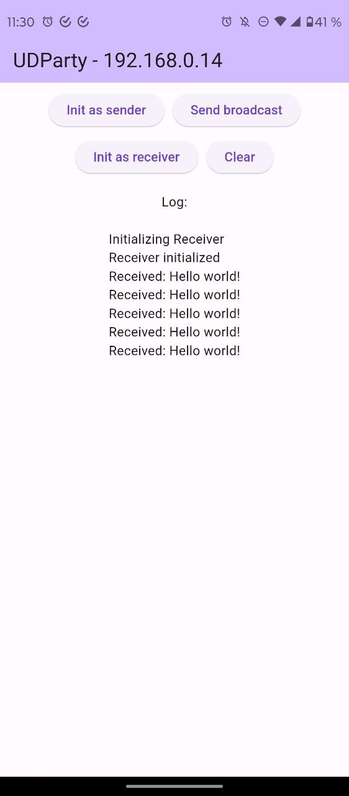

# UDParty

Aplicación Flutter Cliente/Servidor por UDP Multicast

### App Servidor o "Control remoto"

La app que funcione como control remoto mostrará un panel con controles que permitan enviar instrucciones a las apps que estén "escuchando".

### App Clientes

Las apps clientes "escuchan" instrucciones y reaccionan de acuerdo a las instrucciones que reciban.

### ¿Qué tipo de cosas podrán hacer las apps clientes?

Mostrar colores o efectos en pantalla, encender/parpadear el flash, reproducir sonidos, etc. 

### Requicitos

- Tanto la app Servidor como los Clientes deben estar conectados al mismo WiFi.
- Las apps clientes no deben utilizar VPNs o Firewalls que puedan bloquear el tráfico normal de paquetes UDP en la red local. Algunos bloqueadores de ads utilizan una VPN para filtrar el tráfico. En ese caso se puede agregar una excepción para UDParty o bien desactivar temporalmente el ad-blocker por completo.

### TODO

Actualmente la app sólo implementa un mensaje de texto genérico por multicast y su recepción, es decir, sólo es la base de la app.

[ ] Diferenciar pantalla de control y pantalla de cliente

[ ] Mecanismo de reducción de pérdida de datos

[ ] Definir e implementar efectos

[ ] Definir método de distribución (Play, F-Droid, descarga de APK...?)